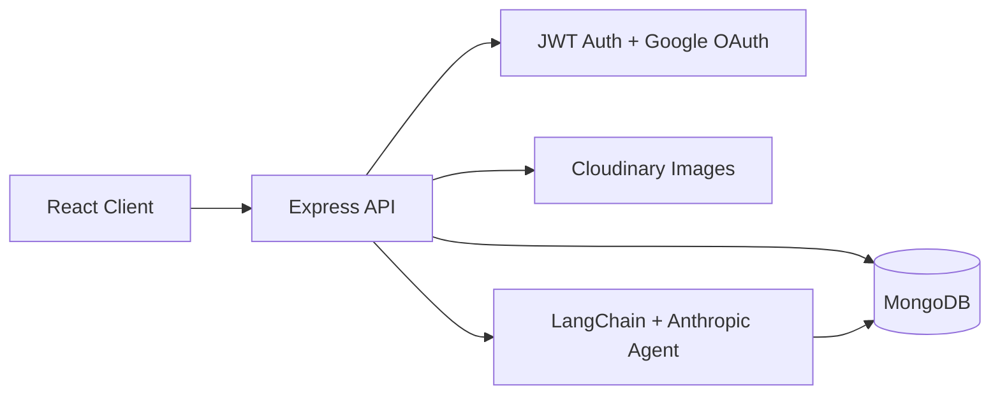

# PerfectPaw Server

Backend API for PerfectPaw, a pet adoption platform for adopters and shelters. The server handles authentication, role-based access, pet listings, shelter dashboards, adoption applications, Cloudinary image uploads, and an AI-powered pet matching agent.

## Stack

- Node.js
- Express
- MongoDB + Mongoose
- JWT + bcrypt
- Auth0 Google OAuth
- Cloudinary + Multer
- LangChain + Anthropic

## Architecture



## Backend Highlights

- Secure auth with bcrypt password hashing, JWT sessions, and Google OAuth support.
- Role-based access for adopters, shelter admins, and platform admins.
- Shelter approval flow before shelter accounts can publish pet listings.
- Cloudinary uploads for optimized pet photos instead of storing images in the database.
- AI pet matching endpoint that returns structured recommendations using LangChain and Anthropic.
- MongoDB relationships between users, shelters, pets, and adoption applications.

## Main Routes

- `POST /api/auth/register`
- `POST /api/auth/login`
- `GET /api/pets`
- `POST /api/pets`
- `GET /api/applications`
- `POST /api/applications`
- `POST /api/agent/match`

## Setup

```bash
npm install
```

Create a `.env` file and add the needed values:

```bash
MONGO_URI=
JWT_SECRET=
CORS_ORIGIN=
CLOUDINARY_CLOUD_NAME=
CLOUDINARY_API_KEY=
CLOUDINARY_API_SECRET=
ANTHROPIC_API_KEY=
```

## Run

```bash
npm run dev
```

## Seed Data

The `scripts/` folder includes seed files for adding starter users, shelters, pets, and applications to MongoDB. Use this when setting up the project locally or resetting demo data.

```bash
npm run seed:all
```
